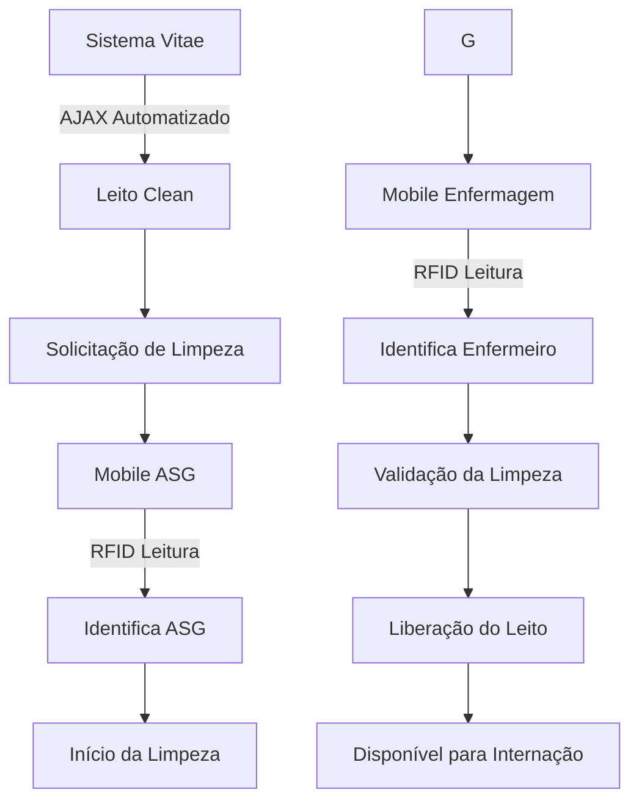

 # 🏥 Leito Clean - Sistema de Gestão de Limpeza de Leitos

## 📋 Sobre o Projeto

O **Leito Clean** é um sistema especializado em gestão de higienização hospitalar, desenvolvido para otimizar o fluxo de limpeza e liberação de leitos. A solução proporciona total rastreabilidade do processo através da integração com leitores RFID, garantindo que os profissionais envolvidos (ASG e Enfermagem) sejam devidamente identificados e registrados em cada etapa do fluxo de limpeza.

### 🏥 Status Atual de Implantação

O sistema encontra-se em fase de **expansão**, atualmente operacional nos setores:
- **UTI III** - Hospital Regional Norte
- **UTI IV** - Hospital Regional Norte

## 🎯 Objetivos de Negócio

- **Reduzir o Turnaround Time (TAT):** Diminuir o intervalo entre a solicitação de limpeza e a liberação do leito.
- **Rastreabilidade Total:** Identificar com precisão quem solicitou, quem realizou a limpeza (ASG) e quem validou (Enfermeiro(a)) através de leitura RFID.
- **Conformidade:** Garantir que os procedimentos de limpeza terminal (concorencial) sejam seguidos conforme padrão ANVISA/CCIH.
- **Integração Segura:** Unificar o acesso através das credenciais do sistema hospitalar existente (Vitae).
- **Comunicação em Tempo Real:** Eliminar o uso de rádios ou telefonemas através de notificações instantâneas.

## 👥 Público-Alvo e Perfis de Acesso

### Autenticação Integrada
O sistema utiliza as mesmas credenciais do **sistema Vitae** (já em uso no Hospital Regional Norte). Apenas profissionais cadastrados no Vitae podem acessar o Leito Clean, garantindo:
- Segurança unificada
- Gestão centralizada de usuários
- Eliminação de cadastros duplicados

### Perfis e Permissões
Dentro do Leito Clean, os usuários são classificados por níveis de acesso:

| Perfil | Permissões |
|--------|------------|
| **ADMIN** | Acesso total ao sistema, incluindo módulos de gerenciamento, relatórios e configurações |
| **GERENTE** | Acesso aos módulos de gerenciamento, dashboards e indicadores |
| **Enfermeiro(a)** | Solicitação e validação de limpezas via interface web ou mobile com RFID |
| **ASG (Higienização)** | Execução da limpeza com registro via RFID no dispositivo móvel |

## 🚀 Funcionalidades Principais

### 1. Múltiplas Interfaces de Acesso

#### 💻 Tela de Gerenciamento (Web)
- Interface completa para ADMIN e GERENTE
- Visualização em tempo real de todas as solicitações
- Dashboards com indicadores e métricas
- Gestão de filas e prioridades
- Relatórios gerenciais

#### 📱 Mobile com Integração RFID
- Dispositivo móvel conectado a um **leitor de cartão RFID**
- Captura automática das informações do funcionário ASG que realiza a limpeza
- Captura automática das informações do Enfermeiro(a) que valida a limpeza
- Interface simplificada para operações em campo
- Registro de início e término das atividades

### 2. Integração com Sistema Vitae
- **Login Unificado:** Autenticação via credenciais do sistema hospitalar existente
- **Requisições AJAX Automatizadas:** Captura de informações em tempo real do sistema Vitae
- **Sincronização de Dados:** Atualização automática de pacientes, leitos e profissionais

### 3. Fluxo Completo de Limpeza

### 4. Autor

Igor Maciel de Sousa