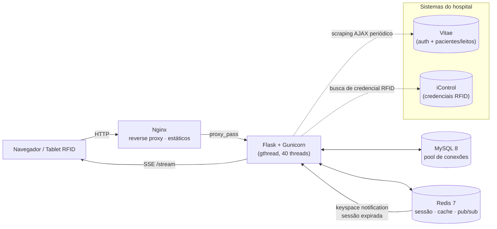

# 🏥 Leito Clean — Sistema de Gestão de Limpeza de Leitos Hospitalares

[](https://www.python.org/)
[](https://flask.palletsprojects.com/)
[](https://www.mysql.com/)
[](https://redis.io/)
[](https://docs.docker.com/compose/)
[](https://nginx.org/)
[]()

> Sistema real, em produção, desenvolvido para o **Hospital Regional Norte (HRN/ISGH)**. Este repositório é uma versão pública de portfólio — os dados de acesso e endereços de sistemas internos foram removidos e substituídos por variáveis de ambiente.

## 📋 Sobre o projeto

O **Leito Clean** digitaliza o fluxo de higienização de leitos hospitalares, que antes era controlado por rádio/telefone e planilhas. O sistema dá rastreabilidade completa: quem solicitou a limpeza, qual ASG (auxiliar de serviços gerais) executou, qual enfermeiro(a) validou, e quanto tempo o leito ficou indisponível — tudo identificado via **leitura de cartão RFID** em tablets espalhados pelos setores.

Está em operação nas UTIs III e IV do HRN, com integração direta ao sistema hospitalar já existente (**Vitae**) para autenticação e dados de pacientes/leitos, evitando cadastros duplicados.

### Objetivos de negócio

- **Reduzir o Turnaround Time (TAT)** entre a solicitação de limpeza e a liberação do leito.
- **Rastreabilidade total** de quem solicitou, executou e validou cada limpeza, via RFID.
- **Conformidade** com os padrões de limpeza terminal/concorrencial exigidos por ANVISA/CCIH.
- **Autenticação unificada** com o sistema hospitalar existente (Vitae), sem cadastro duplicado de usuário.
- **Comunicação em tempo real** entre setores, eliminando rádio e telefone.

## 🏗️ Arquitetura

Quatro serviços orquestrados via Docker Compose, atrás de um reverse proxy:



**Pontos de destaque técnico:**

- **Tempo real via SSE + Redis Pub/Sub** — o painel de gerenciamento recebe atualizações via `/stream` (Server-Sent Events); o backend publica eventos no canal Redis `painel` a cada mudança de status de limpeza.
- **Logout automático orientado a evento** — Redis Keyspace Notifications (`__keyevent@1__:expired`) detectam a expiração da chave de sessão e disparam um evento SSE de logout, sem polling.
- **Pool de conexões MySQL** (`DBUtils.PooledDB`) em vez de conexão por request.
- **Threads de background** para sincronização periódica com o Vitae e verificação de limpezas pendentes/vencidas (com notificação por e-mail).
- **Sessão sem Flask-Session** — gerenciada manualmente sobre Redis, com TTL diferente por perfil de usuário.

## 🧰 Stack tecnológica

| Camada | Tecnologia |
|---|---|
| Backend | Python 3.12, Flask 3.1, Gunicorn (worker `gthread`) |
| Banco de dados | MySQL 8.0 (via PyMySQL + DBUtils pool) |
| Cache / Sessão / Pub-Sub | Redis 7 (Keyspace Notifications, canais dedicados) |
| Tempo real | Server-Sent Events (SSE) |
| Proxy / estáticos | Nginx (Alpine) |
| Relatórios | ReportLab (PDF), openpyxl (XLSX), CSV nativo |
| Integrações | Scraping/AJAX autenticado (Vitae — BeautifulSoup + Requests), API de credenciais RFID (iControl) |
| Notificações | E-mail via SMTP (lote de pendências) |
| Infraestrutura | Docker Compose, usuário não-root no container, healthchecks em todos os serviços |

## 🚀 Funcionalidades

### Painel de gerenciamento (web)
Interface para **ADMIN** e **GERENTE**: fila de limpezas em tempo real, cadastro de funcionários/setores/dispositivos, justificativas com editor rich-text, dashboards e geração de relatórios em **PDF, XLSX e CSV**.

### Terminais mobile/tablet com RFID
Interface simplificada de kiosk para ASG e Enfermagem: leitura de cartão RFID identifica automaticamente quem inicia e quem valida cada limpeza, sem necessidade de login manual em campo.

### Integração com sistemas hospitalares
- **Vitae** (login unificado + dados de pacientes/leitos, sincronizados automaticamente por thread em background).
- **iControl** (consulta de credenciais RFID cadastradas).

### Verificação automática de pendências
Thread dedicada varre limpezas em aberto, dispara alertas por e-mail conforme o tempo de vencimento e atualiza o status em tempo real via evento Redis.

## 👥 Perfis de acesso

Autenticação via credenciais já existentes do sistema Vitae — sem cadastro duplicado.

| Perfil | Permissões |
|---|---|
| **ADMIN** | Acesso total: gerenciamento, relatórios e configurações |
| **GERENTE** | Módulos de gerenciamento, dashboards e indicadores |
| **Enfermeiro(a)** | Solicitação e validação de limpezas (web ou mobile RFID) |
| **ASG (Higienização)** | Execução da limpeza, registrada via RFID no tablet |

## 📁 Estrutura do projeto

```
flask/
├── Dockerfile
├── requirements.txt
└── app/
    ├── config/          # settings.py — variáveis de ambiente, validação, conexões Redis
    ├── database/        # pool de conexões MySQL
    ├── routes/
    │   ├── pages/       # rotas que renderizam HTML (manager + mobile)
    │   ├── api/manager/ # API REST do painel (funcionários, setores, limpezas, relatórios...)
    │   ├── api/mobile/  # API consumida pelos tablets RFID
    │   └── sse.py        # endpoint /stream (Server-Sent Events)
    ├── events/          # publicação de eventos + listener de expiração de sessão (Redis)
    ├── scheduler/        # tarefas periódicas (verificação de pendências)
    ├── services/         # integração Vitae, integração iControl, e-mail, threads
    ├── reports/          # geração de PDF / XLSX / CSV
    ├── static/            # CSS/JS por página
    └── templates/         # HTML (Jinja2) — telas de gerenciamento e mobile
nginx/conf.d/            # reverse proxy + servidor de estáticos
docker-compose.yml        # orquestração: mysql, redis, flask, nginx
scripts/backup.sh          # rotina de backup
docs/                       # documentação técnica completa (PDF)
```

Mais de **50 endpoints** distribuídos entre API de gerenciamento, API mobile e páginas renderizadas.

## ⚙️ Como rodar localmente

Pré-requisitos: Docker e Docker Compose.

```bash
# 1. Clonar o repositório
git clone https://github.com/igota/projeto-leito-clean-docker.git
cd projeto-leito-clean-docker

# 2. Criar o .env a partir do template (preencher com valores próprios)
cp .env.example .env

# 3. Subir os serviços
docker compose up -d --build

# 4. Verificar saúde da aplicação
curl http://localhost/health
```

Isso sobe 4 containers: `mysql`, `redis`, `flask` (Gunicorn) e `nginx` (porta 80), todos com healthcheck configurado.

> Este repositório não inclui as credenciais reais dos sistemas hospitalares (Vitae/iControl) nem o schema do banco de dados, por serem específicos do ambiente de produção do HRN.

## 📄 Documentação adicional

Documentação técnica e funcional completa (arquitetura, modelo de dados, fluxos operacionais, segurança) disponível em [`docs/Leito_Clean_Documentacao_Tecnica.pdf`](docs/Leito_Clean_Documentacao_Tecnica.pdf).

## 👤 Autor

**Igor Maciel de Sousa**
